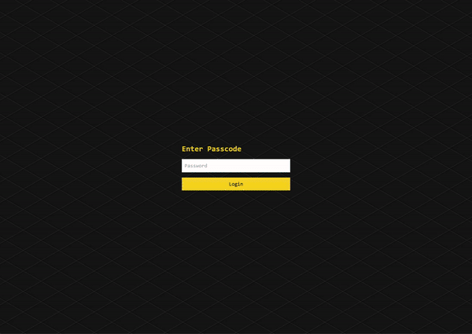

# Ctrl M

Ctrl M is a web application designed to help you quickly notify your friends. With a simple interface, you can send notifications via Discord and Telegram.

## Features

- **Notifications**: Send notifications to Discord and Telegram.
- **User Settings**: Customize your username and settings.

## Getting Started

1. Clone the repository and navigate to the project directory.
2. Install the dependencies using your preferred package manager.
3. Create a `.env` file based on the provided `env.example` and fill in the required environment variables.
4. Run the development server using `npm run dev`, `yarn dev`, `pnpm dev`, or `bun dev`.
5. Open [http://localhost:3000](http://localhost:3000) in your browser to see the result.
